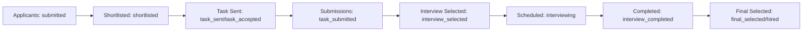

# 🔁 SkillMatch AI — Application Workflow Guide

This document explains **how the SkillMatch AI workflow works** inside the application — from candidate signup → job discovery → recruiter pipeline → interviews → final selection.

---

## 📍 Quick Navigation

- [👥 Roles](#-roles)
- [🧩 Core Concepts](#-core-concepts)
- [🧑‍🎓 Candidate Workflow](#-candidate-workflow)
- [🧑‍💼 Recruiter Workflow (Pipeline)](#-recruiter-workflow-pipeline)
- [🎥 Interviews (Scheduling → Joining)](#-interviews-scheduling--joining)
- [🗂️ Data & Collections (MongoDB)](#-data--collections-mongodb)
- [🧭 Key Routes (Frontend)](#-key-routes-frontend)
- [🔌 Key APIs (Backend)](#-key-apis-backend)
- [🧪 Local Dev (Quick)](#-local-dev-quick)

---

## 👥 Roles

| Role | Primary Goal | Typical Actions |
|---|---|---|
| 👤 Candidate | Find jobs & get hired | Build profile, upload resume, apply to jobs, track progress, attend interviews |
| 🧑‍💼 Recruiter | Hire candidates | Post jobs, review applicants, manage stages, schedule interviews, finalize selection |
| 🛡️ Admin | Govern platform | Oversight + moderation (where enabled) |

**How role is determined**
- Users authenticate via **Firebase Authentication**.
- The backend verifies the Firebase token and looks up the user in MongoDB (`users`) to attach a role to `req.user`.

---

## 🧩 Core Concepts

### ✅ What the platform optimizes for
- A clear **recruiter hiring pipeline** with consistent stage transitions
- A guided **candidate journey** (what to do next, where to go, what’s required)
- A secure, **read‑only AI assistant** for navigation + guidance

### 🧱 Architecture (high-level)

| Part | Location | Notes |
|---|---|---|
| Frontend | `SkillMatch-AI/` | Next.js App Router, React |
| Backend | `SkillMatch-AI-Server/` | Node.js + Express (Vercel compatible) |
| Auth | Firebase | Client sign-in + server verification |
| DB | MongoDB | Primary data storage |
| Realtime | Firebase Realtime DB | Used for pushing notifications/events (best-effort) |

---

## 🧑‍🎓 Candidate Workflow

### 1) Sign up → create a strong profile
1. Candidate signs up / signs in.
2. Candidate completes profile information (name, title, skills, etc.).
3. Candidate can upload a resume (where enabled) for skill extraction and guidance.

**Goal:** A complete profile improves job matching and recruiter confidence.

---

### 2) Explore jobs → apply or save
1. Browse jobs.
2. Save interesting jobs for later.
3. Apply to a job:
   - The backend creates an `applications` record.
   - The application starts in a “new” stage (commonly `submitted`).

---

### 3) Track progress and next steps
Candidates typically use:
- Status labels/badges (based on `applications.status`)
- Dashboard pages (applications, saved jobs, interviews)
- Notifications (stored in MongoDB + pushed via Firebase when configured)

---

## 🧑‍💼 Recruiter Workflow (Pipeline)

Recruiters use a stage-based pipeline UI (stepper) defined in:
- `SkillMatch-AI/src/app/components/PipelineLayout/PipelineLayout.jsx`

### Pipeline stages (UI → status mapping)

| Stage (UI) | Route | `applications.status` values |
|---|---|---|
| Applicants | `/applicants` | `submitted` |
| Shortlisted | `/shortlisted` | `shortlisted` |
| Task Sent | `/task-assignment` | `task_sent`, `task_accepted` |
| Submissions | `/task-submissions` | `task_submitted` |
| Interview Selected | `/interview-selected` | `interview_selected` |
| Scheduled | `/interviews` | `interviewing`, `interview_scheduled` (legacy/compat) |
| Completed | `/interview-completed` | `interview_completed` |
| Final Selected | `/final-selected` | `final_selected`, `hired` |

### Typical recruiter flow



---

## 🎥 Interviews (Scheduling → Joining)

Interviews are a separate collection (`interviews`) that links back to:
- a job (`jobId`)
- an application (`applicationId`)
- a candidate (`applicantId`)
- a recruiter (`recruiterId`)

### Scheduling (recruiter)
From pipeline pages (commonly **Shortlisted**), the recruiter can open the **Schedule Interview** form.

When the form is submitted:
- Frontend calls: `POST /api/interviews/schedule`
- Backend:
  - validates recruiter access
  - generates a unique Jitsi room name for video interviews
  - stores the interview record
  - updates the related application status to **`interviewing`**
  - creates notifications (MongoDB + Firebase push, best-effort)

### Joining (candidate + recruiter)
Both sides join using the **same meeting link** saved on the interview record.

Join routes:
- Recruiter: `/interviews/[interviewId]/join`
- Candidate: `/my-interviews/[interviewId]/join`

How join works:
1. Page fetches interview from backend using the user’s token.
2. Page checks ownership (candidate must own `applicantId`, recruiter must own `recruiterId`).
3. Page redirects to the meeting link (e.g., `https://meet.jit.si/<room>`).

---

## 🗂️ Data & Collections (MongoDB)

| Collection | What it stores |
|---|---|
| `users` | User profile + role (`candidate` / `recruiter` / `admin`) |
| `find_jobs` | Job posts |
| `applications` | Job applications + pipeline `status` + timeline |
| `interviews` | Scheduled interviews + meeting link + metadata |
| `saved_jobs` | Candidate saved jobs |
| `notifications` | In-app notifications (persisted by backend) |

---

## 🧭 Key Routes (Frontend)

### Candidate
- Jobs: `/jobs`
- Resume: `/resume`
- Saved jobs: `/saved-jobs`
- My interviews: `/my-interviews`
- Join interview: `/my-interviews/[interviewId]/join`

### Recruiter
- Pipeline stages:
  - `/applicants`
  - `/shortlisted`
  - `/task-assignment`
  - `/task-submissions`
  - `/interview-selected`
  - `/interviews`
  - `/interview-completed`
  - `/final-selected`
- Join interview: `/interviews/[interviewId]/join`

---

## 🔌 Key APIs (Backend)

### Auth behavior (important)
- Protected routes expect: `Authorization: Bearer <Firebase ID Token>`
- Middleware verifies the token and attaches `req.user = { uid, email, role }`

### Interviews
- `POST /api/interviews/schedule` (recruiter) — create interview + generate meeting link + update application status
- `GET /api/interviews/recruiter` (recruiter) — list interviews created by recruiter
- `GET /api/interviews/candidate` (candidate) — list interviews for candidate
- `GET /api/interviews/:id` — fetch single interview (used by join pages)
- `PATCH /api/interviews/:id/cancel` (recruiter) — cancel interview
- `PATCH /api/interviews/:id/complete` (recruiter) — mark completed and sync application status
- `PATCH /api/interviews/:id/start` (recruiter) — mark live (optional)

---

## 🧪 Local Dev (Quick)

### Backend
```bash
cd SkillMatch-AI-Server
cp .env.example .env
npm ci
npm start
```

### Frontend
```bash
cd ../SkillMatch-AI
cp .env.example .env.local
npm ci
npm run dev
```

